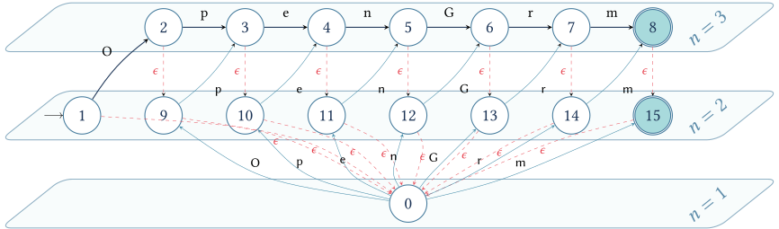

# OpenGrm Libraries

[](https://github.com/google-research/nisaba/blob/main/LICENSE)
[](https://en.cppreference.com/w/cpp/17)
[](https://github.com/google-research/opengrm/actions/workflows/bazel_x64_linux.yml)
[](https://github.com/google-research/opengrm/actions/workflows/cmake_x64_linux.yml)
[](https://github.com/google-research/opengrm/actions/workflows/bazel_arm64_macos.yml)
[](https://github.com/google-research/opengrm/actions/workflows/cmake_arm64_macos.yml)

OpenGrm is a collection of open-source libraries for constructing, combining,
applying and searching formal grammars and related representations, using the
[OpenFst](https://github.com/google-research/openfst) library for their
underlying finite-state models.

## Building

### Prerequisites

*   A C++17 compatible compiler such as
    [gcc >= 7.5.0 or clang >= 14.0.0](https://github.com/google/oss-policies-info/blob/main/foundational-cxx-support-matrix.md#compilers-tools-build-systems).

### Bazel

OpenFst can be built and tested using [Bazel](https://bazel.build) 8 or newer.

```bash
# Build the entire project
bazel build //...

# Run all tests
bazel test //...
```

Alternatively, [Bazelisk](https://github.com/bazelbuild/bazelisk) can be used
for building.

#### Example: Baum-Welch trainer

The following example builds Baum-Welch trainer using Bazelisk on macOS:

```shell
# Get OpenGrm and download Bazelisk.
BAZELISK_VERSION=...
git clone https://github.com/google-research/opengrm.git
wget https://github.com/bazelbuild/bazelisk/releases/download/v${BAZELISK_VERSION}/bazelisk-darwin-arm64
chmod +x bazelisk-darwin-arm64

# Build all the Baum-Welch tools and libraries, and run the tests.
cd opengrm
../bazelisk-darwin-arm64 build -c opt opengrm/baumwelch/...
../bazelisk-darwin-arm64 test -c opt opengrm/baumwelch/...

# Use the tool.
bazel-bin/opengrm/baumwelch/baumwelchtrain --help
```

### CMake

OpenFst can also be built with [CMake](https://cmake.org) 3.22 or higher.

#### Prerequisites

*   If you are building Thrax grammar compiler, the required prerequisite is
    [GNU Bison](https://en.wikipedia.org/wiki/GNU_Bison) parser generator
    (version 3.8 or higher), which on Linux can be installed using the system
    package manager, e.g., `sudo apt-get install bison`.
*   For building Python components (e.g., Pynini):
    *   Python 3.6 or higher and development headers (e.g., `python3-dev`).
    *   [Cython](https://cython.org/) (`pip install cython`).
    *   [absl-py](https://github.com/abseil/abseil-py) (`pip install absl-py`)
        to run tests.

#### Build and Install

Dependencies like Abseil, GoogleTest, and OpenFst are automatically downloaded
using `FetchContent` (or `find_package`).

```bash
# Configure the project.
# Use -DOPENGRM_BUILD_TESTS=OFF to skip building tests.
cmake -S . -B build \
  -DOPENGRM_ENABLE_BAUMWELCH=ON -DOPENGRM_ENABLE_SFST=ON \
  -DOPENGRM_ENABLE_NGRAM=ON -DOPENGRM_ENABLE_THRAX=ON

# Build the project
# On Linux, `-j$(nproc)` can be used to reduce typing.
# https://man7.org/linux/man-pages/man1/nproc.1.html
cmake --build build -j$(getconf _NPROCESSORS_ONLN)

# Run tests
ctest --test-dir build --output-on-failure -j$(getconf _NPROCESSORS_ONLN)

# Install the project
# Use --prefix to specify an installation directory
cmake --install build --prefix /usr/local
```

Prefer shared libraries when building Python extensions.

```bash
# Configure Pynini.
cmake -S . -B build -DOPENGRM_ENABLE_PYNINI=ON -DBUILD_SHARED_LIBS=ON

# Build.
cmake --build build -j$(getconf _NPROCESSORS_ONLN)

# Run tests.
ctest --test-dir build --output-on-failure -j$(getconf _NPROCESSORS_ONLN)
```

#### Configuration Options

You can enable or disable specific features using CMake options (default is
`OFF` unless noted):

Option                     | Description                                     | Default
:------------------------- | :---------------------------------------------- | :------
`OPENGRM_ENABLE_BAUMWELCH` | Build Baum-Welch trainer and decoder components | `OFF`
`OPENGRM_ENABLE_NGRAM`     | Build N-gram library and tools                  | `OFF`
`OPENGRM_ENABLE_SFST`      | Build stochastic finite-state transducers       | `OFF`
`OPENGRM_ENABLE_PYNINI`    | Build Pynini grammars (Python)                  | `OFF`
`OPENGRM_ENABLE_THRAX`     | Build Thrax grammar compiler                    | `OFF`

Additional options include:

Option                    | Description                               | Default
:------------------------ | :---------------------------------------- | :------
`BUILD_BUILD_SHARED_LIBS` | Build shared rather than static libraries | `OFF`
`OPENGRM_BUILD_TESTS`     | Build unit tests                          | `ON`
`OPENGRM_ENABLE_BIN`      | Build command-line executables            | `ON`
`OPENGRM_RUN_SLOW_TESTS`  | Run very slow tests as part of `ctest`    | `OFF`

Example usage:

```bash
cmake -S . -B build -DOPENGRM_ENABLE_SFST=ON -DBUILD_SHARED_LIBS=ON
```

## Pull Requests

At this time, we do not accept pull requests.

Commits may be force-pushed at any time until we start accepting them.

## License

OpenGrm is licensed under the terms of the Apache license. See
[LICENSE](LICENSE) for more information.

## Disclaimer

This is not an officially supported Google product. This project is not eligible
for the
[Google Open Source Software Vulnerability Rewards Program](https://bughunters.google.com/open-source-security).
