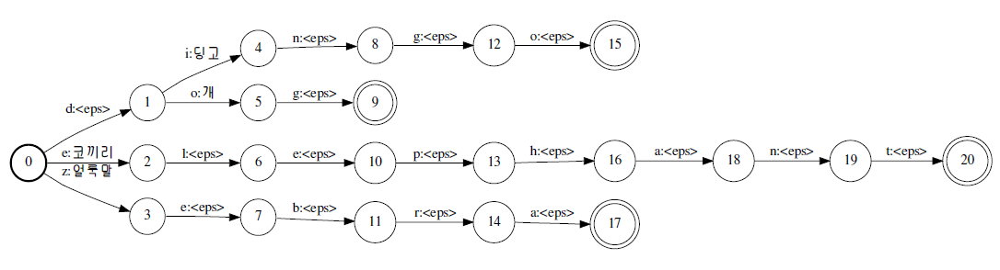

# OpenGrm Thrax Grammar Compiler

The *OpenGrm Thrax Grammar Compiler* is a set of tools for compiling grammars
expressed as regular expressions and context-dependent rewrite rules into
weighted finite-state transducers using the
[OpenFst](https://github.com/google-research/openfst) format.

## Quick Tour

As a starting point we recommend taking a look at the sample grammar provided
with the distribution, which will be installed in
/usr/local/share/thrax/grammars. Copy the contents of that directory to a
directory where you have write permissions and in that directory do the
following:

```
$ thraxmakedep example.grm
$ make
```

This will build an FST archive (far) from the grammar called "example.far". You
can test the grammar as follows:

```
$ thraxrewrite-tester --far=example.far --rules=TOKENIZER
Input string: Well, I can't eat muffins in an agitated manner.
Output string: Well , I ca n't eat muffins in an agitated manner .
Input string: Mr. Ernest Worthing, B. 4, The Albany.
Output string: Mr. Ernest Worthing , B. four , The Albany .
Input string: Lieutenant 1840,
Output string: Lieutenant eighteen forty ,
Input string: Uncle Jack!
Output string: Uncle Ernest !
```

The comments in `example.grm` give an introduction to many of the features in
the toolkit.

`thraxmakedep` takes as optional arguments `--save_symbols` and `--arc_type` ,
which are passed to `thraxcompiler` .

If `--save_symbols` is set, symbol tables will be saved with all FSTs and
carried along with the compilation process. The symbol table is chosen based on
the parse modes of the individual strings that are used to compile the FSTs (see
below): the symbol table will either be a `byte` symbol table, a `utf8` symbol
table or a user-supplied symbol table. This can be useful if one wants to
extract the FSTs from the fars and display them using `fstprint` or `fstdraw` .
If you use this option however, be forewarned of the following points:

*   If symbol tables are used in the compilation of one file in a multi-file
    grammar, then symbol tables must be used in *all* files in the grammar.
    `thraxmakedep` will create the Makefile appropriately to do this, but if you
    change your mind and rebuild, you may find that some of the fars lack symbol
    tables: remove them and recompile in that case.
*   Various FST operations, by default, require symbol tables to match. So if
    you build FSTs with symbol tables, that means that there is a chance you'll
    get it wrong, something will mismatch, and the compilation will fail with an
    error message about mismatched symbol tables. This is usually a good thing:
    without symbol tables, things may blindly work, but you'll get possibly
    meaningless results.
*   Certain operations do not make sense unless symbol tables are consistent
    across the various pieces going into the operation. It is okay, for example,
    to use the `Rewrite` function with a input and output acceptors that have
    mismatched symbol tables: you might map a string compiled in `byte` mode to
    a string compiled in `utf8` mode, for example. The same goes for
    `StringFile` . However, it makes no sense if the input and output of the
    rewrite have mismatched symbol tables in `CDRewrite` : this is because
    `CDRewrite` rewrites portions of the input in a context-dependent fashion,
    and it would be nonsensical to leave the output in an intermediate state
    where portions of it are in the input symbol set and other portions of it
    are in the output symbol set.
*   If you compile strings in `byte` mode, then Unicode symbols beyond the ASCII
    range will be split up into sequences of bytes. As a corollary, one should
    not expect to be able to display such FSTs in a particularly human-friendly
    way: symbols that do not fall in the printable ASCII range will be displayed
    as hex codes.
*   `thraxrewrite-tester` can handle fars containing FSTs with symbol tables,
    but the parse mode for the strings you pass as input to
    `thraxrewrite-tester` must match what's expected in the FSTs: thus if you
    compile the FSTs in `utf8` mode and save the symbol table, the
    `--input_mode` for `thraxrewrite-tester` should also be `utf8` .
*   All of this persnickety behavior can be turned off with by setting
    `--fst_compat_symbols` to false, but that defeats the purpose of saving
    symbol tables.

The flag `--arc_type` supports the same arc types --- `standard` ( `tropical` ),
`log` and `log64` --- as in the OpenFst library. For most purposes you will want
the default tropical semiring, so you should probably not use this flag too
often. Note that `thraxrewrite-tester` will *only* work if the grammar has been
compiled with `standard` arcs.

The `--rules` flag to `thraxrewrite-tester` allows one to specify a
comma-separated list of one or more rules. These rules are composed with the
input in sequence.

If you have GNU readline (or the NetBSD version on Mac OS X), then you can
configure with the `--enable-readline` and then `thraxrewrite-tester` support
inline editing of input and saving of history. You can specify the history file
(defaults to `.rewrite-tester-history` ) with the flag `--history_file` .

The optional argument `--noutput` specifies the number of desired outputs.

The optional argument `--show_details` is useful if you give more than one
argument to the `--rules` flag (e.g. `--rules=FST1,FST2,FST3` ). It will show
the result after each transducer, which can be useful for debugging.

Another useful tool is `thraxrandom-generator` , with arguments `--far` and
`--rules` and optional argument `--noutput` . This generates `noutput` outputs
randomly from the rule. Note that this will not produce meaningful results with
pushdown transducer (PDT) rules.

### Specific Details

Each source file should have the extension .grm. The compiler compiles each
source file to a single FST archive with the extension .far. The FST archive and
the original source file then form a pair which can be used in other files.

Each grammar file has two sections: an **Imports** section, followed by a
**Body** section consisting of interleaved **Functions** and other statements,
each of which is optional. Comments begin with a single pound sign (#) and last
until the next newline.

### Imports

The import section consists of a list of import statements. An import statement
looks like:

```
import 'path/to/file.grm' as alias;
```

This tells the compiler to first find the provided file and load from that all
functions (from the second section, described below) and all exported symbols.
The symbols (FSTs) are loaded from the compiled target FST archive ( `file.far`
) which must be in the same directory as the imported source file. After this,
we can reference functions and symbols from the imported file using the alias.
Therefore, if `file.grm` provides a function named `foo` . then we can call on
that function using the syntax `alias.foo[...]` . Note that an imported file may
itself import other files. To access those functions and FSTs, we can just
append additional aliases:

```
alias.utils.common.kUpperCaseLetters.
```

### Functions

Functions in the language can be specified inline in a grm file. A function
definition uses the `func` keyword, then a function identifier, followed by the
argument list, enclosed by square brackets and delimited by commas, and then the
function body, which consists of a list of statements enclosed by curly braces.
In a function, a single return object (usually an FST) must be returned using
the `return` statement. An example is as follows:

```
func UnionWithTriple[fst] {
 fst3 = fst fst fst;
 result = fst | fst3;
 return result;
}
```

To call this function, we can then use the function name and bind the arguments
as one might expect:

```
export a_or_a3 = UnionWithTriple["a"];
```

A warning will be raised if one defines the same function name twice.

Note that a function may *not* reference a variable defined in the local
environment. Thus the following is illegal:

```
abc = "abc";

func AddAbc[fst] {
 return fst abc;
}
```

Pass the variable as an argument. You may however reference variables defined in
other modules. Thus if module "foo" defines "abc" as above, you can write:

```
func AddAbc[fst] {
 return fst foo.abc;
}
```

We note one caveat about a trap that is easy to fall into. One might be tempted
to write something like:

```
func MyFunction[expression] {
 ...
 return (expression @ operation1) (expression @ operation2);
}
```

where `operation1` and `operation2` are defined in the body of the function. No
doubt the writer of the function would intend that the result be two copies of
the original expression passed to the function, the first composed with
`operation1` and the second with `operation2` . This will not work since regular
relations do not include copy languages (ww). What one will get in this case
instead is an FST that will match two input instances of whatever `expression`
matches, and apply the operations in question to them.

Alternatively, functions in the Thrax language can also be written in C++. To do
this, one should overload the `thrax::function::Function` class and call the
proper registration macros. This is easily done by following the examples of
already-written functions in `src/include/thrax` , e.g.:

```
arcsort.h, cdrewrite.h, closure.h, compose.h, concat.h, determinize.h, difference.h, expand.h, function.h,
invert.h, minimize.h, optimize.h, reverse.h, rewrite.h, rmepsilon.h, stringfile.h, stringfst.h, symboltable.h, union.h
```

It is also necessary to `#include` your new header in `src/lib/loader.cc` and
add a line that registers your function in that file in the obvious place:

```
REGISTER_GRM_FUNCTION(YourFunction);
```

The majority of the built-in functions (such as `union` and `closure` ) are
implemented in this manner. The libraries then need to be rebuilt.

### FST Generation Statements in the Body

The other elements in the **body** are statements that generate the FSTs that
are exported to the FST archive as output. Each statement consists of an
assignment terminating with a semicolon:

```
foo = "abc";
export bar = foo | "xyz";
```

Statements can be preceded with the `export` keyword; such statements will then
be written to the final output archive. Statements lacking this keyword define
temporaries that be used later, but are themselves not output.

### FST String Input

Basic string FSTs are defined by text enclosed by double quotes ("). (Note that
raw strings, such as those used in filenames, are enclosed by single quotes (')
instead.) They can be parsed in one of three ways, which are denoted using a dot
(.) followed by either `byte` , `utf8` , or an identifier holding a symbol
table. Note that within strings, the backslash character (\) is used to escape
the next character. Of particular note, \n translates into a newline, \r into a
line feed, and \t into the tab character. Literal left and right square brackets
will also need escaping, as they are used natively to generate symbols (see
below). All other characters following the backslash are uninterpreted, so that
we can use \" and \' to insert an actual quote (double) quote symbol instead of
terminating the string.

*   The basic way is to treat it as a pure byte string; each arc of the
    resulting FST will correspond to a single 1-byte character of the input.
    This can be specified either by leaving off the parse mode ("abc") or by
    explicitly using the byte mode ("abc".byte).
*   The second way is to use UTF8 parsing by using the special keyword
    ("abc".utf8).
*   Finally, we can load up a symbol table and split the string using the
    `fst_field_separator` flag (found in `fst/src/lib/symbol-table.cc` ) and
    then perform symbol table lookups. *Note that by default the separator is a
    space: thus you must (by default) separate symbols with spaces in your
    string* . Symbol tables can be loaded using the `SymbolTable` built-in
    function.

    ```
    arctic_symbol_table = SymbolTable['/path/to/bears.symtab'];
    pb = "polar bear".arctic_symbol_table;
    ```

*   We can also create temporary symbols on the fly by enclosing a symbol name
    inside brackets within an FST string. All of the text inside the brackets
    will be taken to be part of the symbol name, and future encounters of the
    same symbol name will map to the same label. By default, labels use "Private
    Use Area B" of the unicode table (0x100000 - 0x10FFFD), except that the last
    two code points 0x10FFFC and 0x10FFFD are reserved for the "[BOS]" and
    "[EOS]" tags discussed below.

    ```
    cross_pos = "cross" ("" : "_[s_noun]");
    pluralize_nouns = "_[s_noun]" : "es";
    ```

*   If the symbol name is a complete integer (i.e., a string successfully and
    completely consumed by `strtol()` from `stdlib.h` ) then instead of a
    temporary symbol, we use that number as the arc label directly. This can be
    used to explicitly specify arcs. For example, "[32][0x20][040]" will
    translate into a string FST that matches three space characters, the same as
    " ". This is convenient for representing Unicode characters that don't
    easily print. For example to get the ZERO WIDTH NON-JOINER U+200C, which has
    a UTF8 representation \xe2\x80\x8c, you can use "[0xe2][0x80][0x8c]".

Note that in the current version these temporary symbols will not be handled
gracefully by `thraxrewrite-tester` .

### Keywords & Symbols

A list of reserved keywords and symbols (and examples where appropriate) are
listed below.

*   **=** : used to assign the object on the right side (most commonly an FST)
    to the identifier on the left side.
*   **export** : used to specify that a particular FST symbol (rule) be written
    out to the FST archive.

```
export foo = "abc";
```

*   **()** : used to group an expression to be evaluated first, breaking normal
    precedence rules.
*   **;** : terminates a statement
*   **#** : begins a comment that lasts until the end of the line (until the
    first newline).
*   **.** : used to specify that the preceding string FST be parsed using a
    particular parse mode.

*   **byte** : used to explicitly specify that a string should be parsed
    byte-by-byte for FST arcs. This is the default option when no parse mode is
    specified.

*   **utf8** : used to specify that a string should be parsed using UTF8
    characters for FST arcs.

    ```
    a = "avarice"; # Parse mode = byte.
    b = "brackish".byte; # Parse mode = byte.
    c = "calumny".utf8; # Parse mode = UTF8.
    d = "decrepitude".my_symtab; # Parse mode = symbol table.
    ```

*   **<>** : used to attach a weight to the FST specified. This should be after
    the FST in question and the contents are an arbitrary string (without angle
    brackets) which will be read as the appropriate weight type for the chosen
    arc.

    ```
    foo = "aaa" <1>;
    goo = "aaa" : "bbb" <-1>;
    ```

*   **import** : used to import functions and exported FSTs from another grm
    file into the current one.
*   **as** : specifies the aliased name that the imported file uses in the
    current file.

    ```
    import 'path/to/utils.grm' as utils;
    ```

*   **func** : used to declare and define a function.
*   **[,,]** : used to specify and separate function arguments.
*   **return** : specifies the object to return from the function to the caller.
    This keyword is invalid in the main body. Within a function, statements
    after the return are ignored.

    ```
    func Cleanup[fst] {
      return RmEpsilon[Determinize[fst]];
    }
    ```

### Standard Library Functions, Operations, and Constants

The following are built in functions with special syntax that operate on FSTs,
presented here in order of `decreasing` binding strength. Within a level, all
operations are left-associative unless otherwise specified. All functions are
assumed to expand their arguments (to VectorFst) unless otherwise specified.

*   **Closure** : repeats the argument FST an arbitrary number of times.

*   `fst*` : accepts fst 0 or more times.

*   `fst+` : accepts fst 1 or more times.

*   `fst?` : accepts fst 0 or 1 times.

*   `fst{x,y}` : accepts fst at least x but no more than y times.

*   **Concatenation** : follows the first FST with the second. This operator is
    right-associative. There is also a delayed version which does not expand
    arguments:

    ```
    # foo bar
    Concat[foo, bar]
    ConcatDelayed[foo, bar]
    ```

*   **Difference** : takes the difference of two FSTs, accepting only those
    accepted by the first and not the second. The first argument must be an
    acceptor; the second argument must be an unweighted, epsilon-free,
    deterministic acceptor.

    ```
    # foo - bar
    Difference[foo, bar]
    ```

*   **Composition** : composes the first FST with the second. Using the explicit
    function name allows for option selection regarding the sorting of the input
    arguments. This function uses delayed FSTs.

    ```
    # foo @ bar : This option will sort the right FST's input arcs, exactly the same as would Compose[foo, bar, 'right'].
    Compose[foo, bar] # This way will not perform any arc sorting of the two input FSTs.
    Compose[foo, bar, 'left'|'right'|'both'] # This option will sort either the left FST's output arcs, the right FST's input arcs, or both of the above.
    ```

*   **Lenient Composition** (Thrax 1.2.6 onwards): (
    [Karttunen, 1998](http://citeseerx.ist.psu.edu/viewdoc/download?doi=10.1.1.90.3430&rep=rep1&type=pdf)
    ) leniently composes the first FST with the second, given an alphabet
    sigmastar, where:

    ```
    # LenientComposition(A, B, sigmastar) = PriorityUnion(A@B, A, sigmastar)
    # For example:
    LenientlyCompose[foo, bar, sigma_star]
    ```

*   **Union** : accepts either of the two argument FSTs. The delayed version
    doesn't expand arguments.

    ```
    # foo | bar
    Union[foo, bar]
    UnionDelayed[foo, bar]
    ```

*   **Rewrite** : rewrites strings matching the first FST to the second. (AKA
    "cross product".)

    ```
    # foo : bar
    Rewrite[foo, bar]
    ```

*   **Weight** : attaches a weight to the particular FST.

    ```
    fst <weight>
    ```

We also have functions that operate on FSTs that can only be called via function
name. These are very easy to extend. See the above section on functions for more
information.

*   **ArcSort** : sorts the arcs from all states of an FST either on the input
    or output tape. This function uses delayed FSTs.

    ```
    ArcSort[fst, 'input'|'output']
    ```

*   **CDRewrite** : given a transducer and two context acceptors (and the
    alphabet machine), this will generate a new FST that performs the rewrite
    everywhere in the provided contexts.

*   the 2nd (left context), 3rd (right context) and 4th (sigma star) arguments
    are unweighted acceptors

*   the 5th argument selects the direction of rewrite. We can either rewrite
    left-to-right or right-to-left or simultaneously (Default: 'ltr')

*   the 6th argument selects whether the rewrite is optional. It can either be
    obligatory or optional (Default: 'obl')

*   The designated symbols [BOS] and [EOS] can be used to specify, respectively,
    the beginning and end of a string in regular expressions denoting the left
    and right context.

*   Note that [BOS] and [EOS] cannot be used to denote beginning and end of
    string outside of **CDRewrite** .

*   Note also that one generally wants to use [BOS] only in the left context
    and, similarly, [EOS] only in the right context.

    ```
    # CDRewrite[tau, lambda, rho, sigma_star, 'ltr'|'rtl'|'sim', 'obl'|'opt']
    CDRewrite["s" : "z", "", "d[EOS]", sigma_star] ## ltr obligatory rule changing "s" into "z" before a "d" at the end of a string
    ```

*   **Determinize** : determinizes an FST.

    ```
    Determinize[fst]
    ```

*   **RmEpsilon** : removes all epsilon (label 0) arcs from the argument FST.

    ```
    RmEpsilon[fst]
    ```

*   **Expand** : explicitly expands the provided FST to VectorFst (if the FST
    was already expanded, this just does a reference counted copy and thus is
    fast).

    ```
    Expand[fst]
    ```

*   **Invert** : inverts the provided FST. This function uses delayed FSTs.

    ```
    Invert[fst]
    ```

*   **Minimize** : minimizes the provided FST.

    ```
    Minimize[fst]
    ```

*   **Optimize** : optimizes the provided FST as described
    [here](/twiki/bin/view/GRM/PyniniOptimizeDoc) .

    ```
    Optimize[fst]
    ```

*   **Project** : projects the provided FST onto either the input or the output
    dimension.

    ```
    Project[fst, 'input'|'output']
    ```

*   **Reverse** : reverses the provided FST.

    ```
    Reverse[fst]
    ```

The following are built-in functions that do other tasks. Note that
`thraxmakedep` will construct appropriate dependencies for files indicated with
these functions. See the compilation rules below for more information.

*   **AssertEqual** asserts the equality of the shortest path of the output of
    two transducers, returning either the output of the left transducer, or NULL
    if the assertion fails. Note that the compilation will fail if the assertion
    fails.This is particularly useful for putting sanity checks in grammars. See
    `assert.grm` in the distributed grammars file. E.g.:

    ```
    AssertEqual["dog" @ pluralize, "dogs"]
    ```

*   **AssertEmpty** is syntactic sugar: `AssertEmpty[fst]` is equivalent to
    `AssertEqual[fst, ""]` .
*   **AssertNull** asserts that the FST is null. E.g.:

    ```
    AssertNull["dog" @ "cat"]
    ```

*   **RmWeight** removes weights from an FST:

    ```
    RmWeight[myfst]
    ```

*   **LoadFst** : we can load FSTs either directly from a file or by extracting
    it from a FAR.

    ```
    # LoadFst['path/to/fst']
    LoadFstFromFar['path/to/far', 'fst_name']
    ```

*   **StringFile** : loads a file consisting of a list of strings or pairs of
    strings and compiles it (in byte mode) to an FST that represents the union
    of those string. It is equivalent to the union of those strings ("string1 |
    string2 | string3 | ..."), but can be significantly more efficient for large
    lists.

    ```
    StringFile['strings_file']
    ```

If the file contains single strings, one per line, then the resulting FST will
be an acceptor. If the file contains pairs of *tab-separated* strings, then the
result will be a transducer. The parse mode of the strings may be specified as
arguments to the `StringFile` function. Thus

```
StringFile['strings_file', 'byte', my_symbols]
```

would apply to a file with pairs of tab-separated strings, where the strings on
the left are to be parsed in byte mode (the default) and the strings on the
right are parsed using a user-specified symbol table `my_symbols` .

An example will serve to illustrate:

```
rws@catarina:~/tmp$ cat foo.sym
<eps> 0
얼룩말 1
개 2
딩고 3
코끼리 4
rws@catarina:~/tmp$ cat foo.grm
foo_syms = SymbolTable['foo.sym'];
export foo = StringFile['foo.txt', 'byte', foo_syms];
rws@catarina:~/tmp$ cat foo.txt
dingo 딩고
dog 개
zebra 얼룩말
elephant 코끼리
```

The resulting FST looks as follows: 

Starting with Thrax 1.2.4, a "#" indicates a comment from that point to the end
of the line. If you want a real "#", it should be escaped with "\".

*   **Symbol Table** : loads and returns the symbol table at the path specified
    by the string argument. Note that the `indir` flag (found in
    `thrax/src/lib/flags.cc` ) is prepended (if possible) as the initial path in
    which the compiler searches for the resource.

    ```
    SymbolTable['path/to/symtab']
    ```

Starting with Thrax 1.2.6 an optional third column may be used to assign a
weight to a mapping:

```
dog bone 0.5
dog cheese 1.0
```

produces an FST where "dog" maps to "bone" with weight 0.5 and to "cheese" with
weight 1.0.

There exist also some potentially useful constants. In the `byte.grm` file,
distributed to `/usr/local/share/thrax/grammars` , we have the following
pre-defined FSTs, which accept what the corresponding `is*()` functions from
C++'s `ctype.h` library accept. These are built to work with the byte-style
interpretation of strings.

*   **kDigit** : single digits from 0 to 9
*   **kLower** : lower case letters from a to z
*   **kUpper** : upper case letters from A to Z
*   **kAlpha** : the union of `kLower` and `kUpper` (all alphabet letters in
    either case)
*   **kAlnum** : the union of `kDigit` and `kAlpha` (all alphabet letters in
    either case plus digits)
*   **kSpace** : whitespace (space, tab, newline, carriage return)
*   **kNotSpace** : characters in the range 1 to 255 except for the above
    whitespaces
*   **kPunct** : the majority of printable "punctuation" characters
*   **kGraph** : the union of `kAlnum` and `kPunct` (all printable ASCII
    characters)
*   **kBytes** : the entire byte range from 1 to 255.

### Further Functionality

#### Pushdown Transducers

The
[PDT extension](https://github.com/google-research/openfst/blob/main/docs/pdt_extension.md)
to the OpenFst library provides an implementation of pushdown transducers
capable of handling context-free languages. Basically one defines a set of mated
parentheses, and then constructs an automaton that generates strings of
parentheses and ordinary labels. Algorithms such as Expand and ShortestPath
determine when the parentheses are properly mated.

Thrax's interface to PDTs consists of several pieces. First one must define a
set of parentheses. This one does by defining a set of symbols --- e.g. by just
using them in an expression:

```
left_parens = "[<S>][<NP>][<VP>]";
right_parens = "[</S>][</NP>][</VP>]";
```

One must then define the mating between the symbols, using a simple mapping
transducer:

```
export PARENS =
 ("[<S>]" : "[</S>]")
 | ("[<NP>]" : "[</NP>]")
 | ("[<VP>]" : "[</VP>]")
```

Note a couple of things. First, because of the way the PDT algorithms are
written it is a good idea to define all the left parentheses together, then all
the right parentheses, as we have done here. Second, the `PARENS` rule should be
exported, since it will be needed if you intend to use the PDT outside the
grammar.

Next one can define a set of expressions involving parentheses and ordinary
labels. The simple grammar in the distribution `pdt.grm` defines **anbn** .

Note that if you want to compose PDT expressions with other expressions you must
use `PdtCompose` . E.g.:

```
PdtCompose[sigma*, PDT, PARENS, 'right_pdt'];
```

The first or second argument should be the PDT, the other of the first or second
argument an ordinary transducer, the third argument should be the PARENS
transducer and the final argument either 'right_pdt' or 'left_pdt' according to
whether the second or the first argument is the PDT. This allows for the correct
application of compose, and appropriate treatment of the parenthesis symbols.

Finally, to use this in `thraxrewrite-tester` one must specify the rule and the
associated parenthesis transducer (which must therefore have been exported, as
noted above). Thus for the grammar in `pdt.grm` :

```
$ thraxrewrite-tester --far=pdt.far --rules=PDT\$PARENS
Input string: aabb
Output string: aabb
Input string: ab
Output string: ab
Input string: aaaabbbb
Output string: aaaabbbb
Input string: abb
Rewrite failed.
```

Starting with 1.2.4, ":" may be used in place of "$" to indicate pdt/parens
pair, as a more bash-friendly alternative.

#### Multi-Pushdown Transducers

The
[MPDT extension](https://github.com/google-research/openfst/blob/main/docs/mpdt_extension.md)
to the OpenFst library provides an implementation of multi-pushdown transducers.
MPDTs allow for coverage beyond context-free. An MPDT requires a set of sets of
mated parentheses, one set for each *stack* , and a set of affiliations that
define which stack each mated parenthesis belongs to. The underlying
implementation in OpenFst supports multiple stacks, and in addition multiple
*stack disciplines* , which control the ways in which the parentheses may be
pushed (written) or popped (read). See the discussion on the
[MPDT extension](https://github.com/google-research/openfst/blob/main/docs/mpdt_extension.md)
page. The Thrax interface only supports the default configuration from OpenFst,
which is `two stack` and `READ_RESTRICT` . This allows for copying operations
such as those required to handle morphological reduplication.

As with PDTs, Thrax's interface to MPDTs consists of several pieces. To
illustrate, we will work here with the example grammars in `bytestringcopy.grm`
and `mpdt.grm` . The grammar in `bytestringcopy.grm` defines a push-pop
discipline with a parenthesis associated with every byte value from 1 to

1.  For example the push definition starts with:

```
push = Optimize[
 "[1][1(1]"
 | "[2][2(1]"
 | "[3][3(1]"
 | "[4][4(1]"
 | "[5][5(1]"
 | "[6][6(1]"
```

After each byte value, an associated left parenthesis is pushed. Thus after byte
value `6` , parenthesis `6(1` is pushed. By convention we name the parenthesis
here by the byte value `6` , it's status as left or right (here `(` for left)
and the stack with which it is associated `1` .

Then we define a pop-push discipline that pops right parentheses matching one of
the previously pushed parentheses, and at the same time pushes a new left
parenthesis onto the *second* stack:

```
poppush = Optimize[
 "[1)1][1(2]"
 | "[2)1][2(2]"
 | "[3)1][3(2]"
 | "[4)1][4(2]"
 | "[5)1][5(2]"
 | "[6)1][6(2]"
```

Finally we define a pop discipline for the second stack:

```
pop = Optimize[
 (("" : "[1]") "[1)2]")
 | (("" : "[2]") "[2)2]")
 | (("" : "[3]") "[3)2]")
 | (("" : "[4]") "[4)2]")
 | (("" : "[5]") "[5)2]")
 | (("" : "[6]") "[6)2]")
```

In this case we insert a byte and match the equivalent closing parenthesis for
the second stack.

How does this work? Imagine you read the sequence "abc". As you read each byte
you will insert the appropriate left parentheses onto the first stack by the
first definition above. Then, when you get to the end of the string you will pop
each of those and as you do so, you will insert the corresponding opening
parenthesis from the second stack (as in the second definition above). Obviously
these will be inserted in *reverse* order. Then you will insert bytes, and the
corresponding right parentheses which will be in the *reverse of the reverse*
order, or in other words the same order as the original first-stack opening
parentheses. The MPDT requires that the parentheses on both stacks must balance,
and thus for each input string `w` , one will have an output `ww` .

This allows us to define a `REDUPLICATOR` as follows, where for efficiency
reasons it it is assumed that one has marked the end of one's input with a
special symbol `COPYEND` :

```
export REDUPLICATOR = Optimize[push* "[COPYEND]" poppush* pop*];
```

As with PDTs, one must also define the set of matings of the parentheses:

```
export PARENS = Optimize[
 ("[1(1]" : "[1)1]")
 | ("[2(1]" : "[2)1]")
 | ("[3(1]" : "[3)1]")
 | ("[4(1]" : "[4)1]")
 | ("[5(1]" : "[5)1]")
 | ("[6(1]" : "[6)1]")
```

And in addition one must define the stack affiliations of the parentheses:

```
export ASSIGNMENTS = Optimize[
 ("[1(1]" : "[1]")
 | ("[2(1]" : "[1]")
 | ("[3(1]" : "[1]")
 | ("[4(1]" : "[1]")
 | ("[5(1]" : "[1]")
 | ("[6(1]" : "[1]")
```

The grammar `mpdt.grm` gives several linguistically interesting examples of the
usage of MPDTs, including partial reduplication and infixing reduplication.

Note that as with one must use the designated composition operation
`MPdtCompose` , e.g.:

```
MPdtCompose[MPDT, fst, PARENS, ASSIGNMENTS, 'left_mpdt'];
```

The first or second argument should be the MPDT, the other of the first or
second argument an ordinary transducer, the third argument should be the PARENS
transducer, the fourth the ASSIGNMENTS and the final argument either
'right_mpdt' or 'left_mpdt' according to whether the second or the first
argument is the MPDT. This allows for the correct application of compose, and
appropriate treatment of the parenthesis symbols.

Finally, to use this in `thraxrewrite-tester` one must specify the rule, the
associated parenthesis transducer, and the stack affiliations transducer, both
of which must therefore have been exported. Thus for the grammar in `pdt.grm` :

```
$ thraxrewrite-tester --far=mpdt.far --rules=INFIXING_REDUPLICATION\$PARENS\$ASSIGNMENTS
Input string: kidongo
Output string: kididongo
Input string: fungus
Output string: fungungus
```

Starting with 1.2.4, ":" may be used in place of "$" to indicate
pdt/parens/assignments triple, as a more bash-friendly alternative.

### Features and morphological paradigms

Thrax version 1.1.0 adds functionality for more easily handling linguistic
features and some aspects of paradigmatic morphology. The grammar
`paradigms_and_features.grm` in the distribution shows a simple example of this
functionality.

#### Features

First of all, the support for features allows one to represent features,
categories (bundles of features), and feature vectors (particular instantiations
of categories) as FSTs. While one could do all of this without this module, it
makes it easier since once one has defined features, one no longer has to worry
about specifying the order of the feature values or of specifying all feature
values.

To take an example, one can define a set of features as follows:

```
case = Feature['case', 'nom', 'acc', 'gen', 'dat'];
number = Feature['number', 'sg', 'pl'];
gender = Feature['gender', 'mas', 'fem', 'neu'];
```

Then a category 'noun' as being a collection of these features:

```
noun = Category[case, number, gender];
```

Then a particular noun form could be defined as

```
neu_nom = FeatureVector[noun, 'gender=neu', 'case=nom'];
```

Note that in the latter case, the order does not matter, and we do not need to
specify a value for number: ordering is handled by the system, and for
unspecified features it generates a disjunction matching all possible values of
the feature.

Feature specifications get translated into simple 2-state FSTs that recognize
only the disjunction of the given feature and its values. Thus for example,

```
gender = Feature['gender', 'mas', 'fem', 'neu'];
```

will translate into

```
0 1 gender=mas
0 1 gender=fem
0 1 gender=neu
1
```

The labels "gender=mas", etc. are added to the set of generated labels.

A `Category` is simply a sequence of `Features` , and is represented by an
automaton that has **N+1** states, where **N** is the number of features.

Thus

```
noun = Category[case, number, gender];
```

will become:

```
0 1 case=nom
0 1 case=gen
0 1 case=dat
0 1 case=acc
1 2 gender=mas
1 2 gender=fem
1 2 gender=neu
2 3 number=sg
2 3 number=pl
3
```

Note that the ordering is determined based on the lexicographic order of the
feature. No matter what order we specify in the call to `Category[]` , the order
is always "case", "gender", "number". Thus the following are all equivalent to
the above:

```
noun = Category[number, gender, case];
noun = Category[case, gender, number];
etc.
```

`Category` checks to make sure that each acceptor passed to it is a valid
`Feature` acceptor meaning that it must have 2 states, be acyclic, and have arcs
labeled with labels of the form "x=y", where all the "x"s must be the same.

A `FeatureVector` allows one to specify a set of features for a given category.
The first argument is the previously defined `Category` acceptor.
`FeatureVector` checks that the first argument is a valid `Category` acceptor,
and that the other arguments are strings that represent valid features for that
category.

Feature optionally allows the last argument to be a parse mode ('byte', 'utf8',
or a symbol table). The default is 'byte'. This does not affect the parsing of
the feature specification, but if you use `--save_symbols` then you will need to
use this to make sure the feature acceptors have appropriate symbol tables for
combining with other fsts.

#### Paradigms

The `Paradigm` functionality provides for various functions for building and
maintaining inflectional paradigms, which are equivalence classes of words that
share morphological behavior. Examples of paradigms are the declensions of nouns
and adjectives in Latin, which fall into 5 basic paradigms defined by the
endings used to mark case, number and gender. Within each of these 5 classes
there are many subclasses, paradigm patterns that behave mostly like the parent
paradigm, but differ in a few cases. For example, among masculine nouns in
declension 2 the default ending in the nominative singular is "-us". There are
however nouns such as "puer" ('boy') and "vir" ('man') that lack the "-us"
ending in the nominative singular, but otherwise are inflected like other
declension 2 masculine nouns.

The basic ways in which these tools are used is as follows. First of all, define
a paradigm using regular expressions. Note that the paradigm should represent an
acceptor:

```
decl2nomsg = sigma* "+us[cas=nom][num=sg]";
decl2gensg = sigma* "+i[cas=gen][num=sg]";
...
decl2nompl = sigma* "+i[cas=nom][num=pl]";
decl2nompl = sigma* "+orum[cas=gen][num=pl]";
...
declension2 = decl2nomsg | decl2gensg | decl2nompl | decl2genpl ... ;
```

Then we use the functions below to create analyzers, taggers, and to replace
specific forms within a paradigm as for "vir" and "puer" above.

The first of these functions is `Analyzer` :

```
Analyzer[paradigm, stems, stemmer, deleter]
```

Given an acceptor defining a paradigm, another acceptor defining a set of stems,
a transducer that computes the relation between stems and the fully inflected
forms, and a transducer to delete grammatical info (e.g. features, morph
boundaries) not found in the surface forms, construct an analyzer that will take
any inflected form of any stem according to the paradigm, and return an analysis
of that form.

For example if the paradigm defines forms as in the introduction above, and we
have the stems "bon", "maxim" and a stemmer:

```
CDRewrite["+" sigma_star : "", "", "[EOS]", sigma_star];
```

and a deleter that deletes "+" and feature tags such as `[cas=nom][num=sg]` then
the analyzer constructed here will map, e.g.

```
maximus -> maxim+us[cas=nom][num=sg]
boni -> bon+i[cas=nom][num=pl]
```

The next is `Tagger` :

```
Tagger[paradigm, stems, stemmer, deleter, boundary_deleter]
```

A tagger is just like an analyzer except that instead of outputting full
analysis of the form, it outputs the form along with its morphosyntactic
features. Tagger first builds an analyzer, then composes that with an additional
FST that deletes just the boundaries.

If the `boundary_deleter` is instead a transducer that maps every inflected form
to the dictionary form (lemma) of the word, then this becomes a **lemmatizer** .
For example, in Latin 2nd declension masculine nouns, map all endings to "us":

```
maximorum -> maximus[cas=gen][num=pl]
```

The inversion of a lemmatizer is an **inflector** :

```
maximus[cas=gen][num=pl] -> maximorum
```

Finally, there is `ParadigmReplace` :

```
ParadigmReplace[paradigm, old_forms, new_forms]
```

Given an acceptor defining a paradigm, a (possibly empty) acceptor defining the
old set of forms to replace, and another (possibly empty) acceptor defining the
new forms. Perform the replacement of `old_forms` with `new_forms` . This is
most useful in cases where we want to define a new paradigm that is just like
another paradigm, except in a few forms. For example, one can define the
replacement needed for "vir", "puer" (see above) by redefining the nominative
singular ending:

```
decl2nomsgr = sigma* "+" "[cas=nom][num=sg]";
```

Then one could do:

```
declension2r = ParadigmReplace[declension2, decl2nomsg, decl2nomsgr];
```

### Replace Transducers

This gives an interface to OpenFst's
[replace class](https://github.com/google-research/openfst/blob/main/docs/replace.md).
This is useful if one wants to define an overall topology for a grammar, and
then replace nodes in that topology with specific FSTs. For example, one might
define measure expressions as expressions that take a number and a measure
phrase. Then one could replace those high-level concepts with, say, the
particular expressions of numbers and measure words in various languages.

The interface is lamentably as unintuitive as OpenFst's interface, but an
example is provided in the distributed grammars ( `replace.grm` ), which
hopefully helps clarify it. The discussion here is a slight simplification of
what is in that grammar.

`Replace` takes as arguments first single string FST where each label
corresponds one for one with the remaining arguments. This first argument serves
to match up the remaining arguments with their specific function. The first
symbol should be the root symbol, corresponding to the second argument, which
should define the topology defining how the remaining arguments combine.

Thus consider the following definition (simplified somewhat from `replace.grm`
):

```
Replace["[ROOT][NUMBER][MEASURE]",
 # This corresponds to "[ROOT]" in the replacement sequence. Think of
 # it as the skeleton onto which the flesh will be attached.
 "[NUMBER] [MEASURE]",
 # This is a definition of numbers: it is the flesh associated
 # with [NUMBER].
 n.NUMBERS,
 # This is the flesh associated with [MEASURE].
 measures]
```

`[ROOT][NUMBER][MEASURE]` says that each of the following FST arguments
corresponds, respectively, to the root machine, the number and measure machine.
The root machine is defined as "[NUMBER] [MEASURE]", or in other words a number,
followed by a space followed by a measure. The remaining two arguments define
what number and measure actually mean.

Think of the first argument as merely providing a labeling for the third and
following arguments, so that they can be correctly replaced into the root
machine in the second argument.

### Tips and Tricks

*   As of version 1.1.0, generated labels may not be single characters. This is
    to avoid confusion between, say, "a" with its normal (byte) interpretation
    and "a" with some other value generated from input "[a]".
*   Especially when using composition, it is often a good idea to call
    `Optimize[]` on the arguments; some compositions can be massively sped up
    via argument optimization. However, calling `Optimize[]` across the board
    (which one can do via the flag `--optimize_all_fsts` flag) often results in
    redundant work and can slow down compilation speeds on the whole. Judicious
    use of optimization is a bit of a black art.
